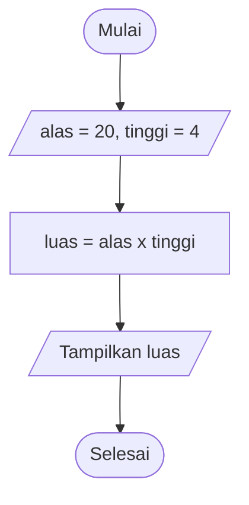

# Pemrograman Dasar

Program sederhana Python untuk menghitung luas sesuai soal latihan pemrograman dasar.

## Deskripsi

Program menghitung luas dengan data berikut:

| Variabel | Nilai |
|----------|-------|
| Alas     | 20    |
| Tinggi   | 4     |
| Luas     | Alas x Tinggi |

Hasil: `Luas = 20 x 4 = 80`

> Catatan: rumus luas segitiga yang benar adalah `1/2 x alas x tinggi` (hasil 40). Program ini mengikuti rumus yang tertulis pada soal, yaitu `alas x tinggi`.

## Pseudo Code

```
MULAI
  alas   <- 20
  tinggi <- 4
  luas   <- alas x tinggi
  TAMPILKAN luas
SELESAI
```

## Flow Chart



## Kode Python

File: `luas_segitiga.py`

```python
alas = 20
tinggi = 4

luas = alas * tinggi

print("Alas   =", alas)
print("Tinggi =", tinggi)
print("Luas   =", luas)
```

## Cara Menjalankan

1. Pastikan Python terpasang (contoh: Anaconda).
2. Clone repo:

   ```
   git clone https://github.com/USERNAME/pemrograman-dasar.git
   cd pemrograman-dasar
   ```

3. Jalankan:

   ```
   python luas_segitiga.py
   ```

Output:

```
Alas   = 20
Tinggi = 4
Luas   = 80
```

Program tidak memakai library eksternal, jadi tidak perlu `pip install`. Virtual environment bersifat opsional.

## Kontributor

- NAMA_ANDA
- NAMA_TEMAN
